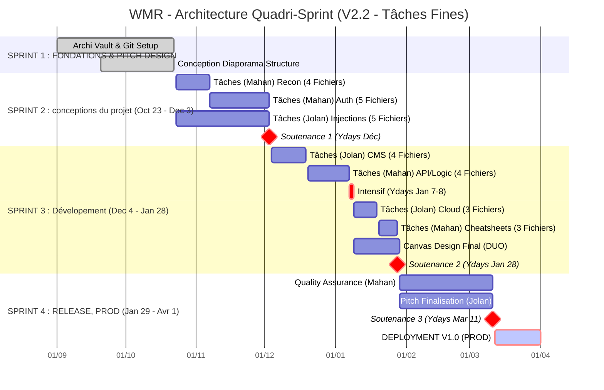

#  PLAN DE BATAILLE : PROJET WMR (Web Mindmap Recipes)

**Opérateurs :** Jolan & Mahan **Objectif :** Création de l'ultime Base de Connaissance Offensive Web (Obsidian Canvas) **Deadline :** 1er Avril 2026 (Soutenance) **Méthodologie :** Agile / Sprints synchronisés sur les sessions Ydays

## ⚔️ Répartition des Spécialités (Rôles)

Pour maximiser l'efficacité, divisez le spectre des attaques :

| Agent     | Rôle Tactique                         | Responsabilités (Modules WMR)                                                                                |
| --------- | ------------------------------------- | ------------------------------------------------------------------------------------------------------------ |
| **Jolan** | **Architecte & Injection Specialist** | Structure du Vault, Design du Canvas, OWASP Injections (SQLi, XSS, SSTI), Automatisation (Scripts Obsidian). |
| **Mahan** | **Logic Hunter & Infra Ops**          | Auth & Identity (JWT, OAuth), API Security, Business Logic, Cloud/Infra (Docker, AWS), Review Technique.     |

## 📊 Roadmap Stratégique (Mermaid Gantt)


```
```

## 🏃 Détail des Sprints & Objectifs Ydays

Chaque session Ydays sert de **Sprint Review** (Démo de ce qui a été fait) et de **Sprint Planning** (Lancement de la phase suivante).

### 🟢 PHASE 1 : Architecture & Fondations

**Période :** Septembre - 22 Octobre 2025

- **Objectifs :**
    
    - Mise en place du Git et du Vault Obsidian.
        
    - Définition de la charte graphique (Templates, Tags, CSS).
        
    - Création de l'arborescence de dossiers vide.
        
- **Tâches :**
    
    - _Jolan :_ Configurer Obsidian, Plugins (Advanced URI, Templater), Design du Master Canvas vide.
        
    - _Mahan :_ Collecte des ressources (Cheatsheets, Payloads lists), Définition du Scope exact.
        
- **🎯 JALON YDAYS (22 Octobre) :** Démo du Vault vide mais fonctionnel. Le squelette est prêt.

### 🟡 PHASE 2 : Le Cœur du Réacteur (OWASP Top 10)

**Période :** 23 Octobre - 3 Décembre 2025

#### Sprint 2 : Recon & Auth (Jusqu'au 12 Nov)

- _Mahan :_ Rédaction module **Authentification** (JWT, OAuth, IDOR).
    
- _Jolan :_ Rédaction module **Reconnaissance** (Nmap, Ffuf, Subdomains).
    
- **🎯 JALON YDAYS (12 Novembre) :** Présentation des premiers modules "jouables".
    

#### Sprint 3 : Injections & RCE (Jusqu'au 3 Déc)

- _Jolan :_ Module **Injections** (SQLi, XSS, SSTI) + Création des diagrammes Mermaid associés.
    
- _Mahan :_ Module **Command Injection & File Upload**.
    
- **🎯 JALON YDAYS (3 Décembre) :** Le "Core" offensif est terminé.
    

### 🔴 PHASE 3 : Advanced Warfare (L'Intensif)

**Période :** 4 Décembre 2025 - 28 Janvier 2026

#### Sprint 4 : Préparation Intensif (Jusqu'au 7 Janvier)

- Recherche et brouillons sur les sujets complexes : API GraphQL, Cloud Metadata, Docker Breakout.
    

#### ⚡ SPRINT INTENSIF YDAYS (7-8 Janvier 2026)

- **Mode Hackathon (2 jours complets)**.
    
- **Objectif :** Coder et intégrer TOUT le module **Cloud & Infrastructure** et **API**.
    
- _Action :_ Remplissage massif du Vault. On connecte les notes entre elles.
    
- _Livrable soir du 8 Janvier :_ 80% du contenu textuel est dans la base.
    

#### Sprint 5 : Intégration & Business Logic (Jusqu'au 28 Janvier)

- _Mahan :_ Finalise les failles de logique métier (Race conditions, Mass assignment).
    
- _Jolan :_ Commence à placer les notes sur le Canvas visuel (Le "War Room").
    
- **🎯 JALON YDAYS (28 Janvier) :** Revue de l'intégralité du contenu. Début du travail purement visuel.
    

### 🟣 PHASE 4 : UX & "Weaponization"

**Période :** 29 Janvier - 1 Avril 2026

#### Sprint 6 : The Canvas Awakening (Jusqu'au 11 Mars)

- **Objectif Unique :** Transformer les notes textes en **Graphes Visuels**.
    
- _Tâche Duo :_ Jolan et Mahan passent leur temps sur le Canvas. Création des liens, des codes couleurs, des flux d'attaque.
    
- Nettoyage des liens morts. Ajout des captures d'écran.
    
- **🎯 JALON YDAYS (11 Mars) :** **Pré-Soutenance (Dry Run)**. Le projet doit être fini à 95%. On teste la présentation orale.
    

#### Sprint 7 : Final Polish & Pitch (Jusqu'au 1 Avril)

- Correction des bugs remontés le 11 mars.
    
- Préparation des slides de soutenance.
    
- Création d'une démo vidéo (au cas où l'effet démo frappe le jour J).
    
- Publication éventuelle sur GitHub (Open Source).
    

### 🏁 JOUR Z : 1er Avril 2026

- **SOUTENANCE FINALE**.
    
- Déploiement de la WMR.
    

```

### Directives Finales pour Jolan et Mahan

1.  **Git est votre ami :** Le Vault est du texte. Utilisez Git pour versionner. Si vous travaillez sur le même fichier, gare aux conflits de fusion (Merge Conflicts). Chacun sa branche ou chacun son fichier.
2.  **Qualité > Quantité :** Mieux vaut 20 techniques d'attaque ultra-détaillées et fonctionnelles que 100 notes vides copiées-collées de Wikipédia.
3.  **Testez vos recettes :** Si vous écrivez une commande `curl` ou `sqlmap`, assurez-vous qu'elle fonctionne.

Exécution immédiate.
```