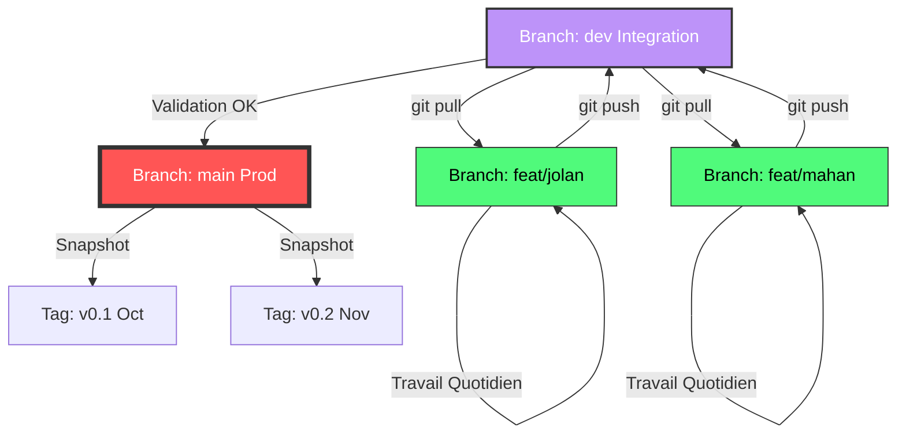

# PROTOCOLE OPÉRATIONNEL : GESTION DE VERSION (GIT)

**Projet :** WMR (Web Mindmap Recipes) **Opérateurs :** Jolan & Mahan **Statut :** DOCUMENT DE RÉFÉRENCE TECHNIQUE

Ce document définit les règles d'engagement pour la synchronisation du Vault Obsidian. Le non-respect de ce protocole entraînera des conflits de fusion et une corruption potentielle des connaissances.

## 1. 🌳 Stratégie de Branchement (Branching Model)

Nous utilisons une structure hiérarchique stricte pour protéger l'intégrité des données.

| Branche            | Type           | Accès          | Description                                                                                                                                  |
| ------------------ | -------------- | -------------- | -------------------------------------------------------------------------------------------------------------------------------------------- |
| **`main`**         | **PRODUCTION** | 🔒 Read-Only   | La "Golden Copy". Contient uniquement le travail validé, relu et fonctionnel. C'est la version présentée lors des soutenances.               |
| **`dev`**          | **STAGING**    | 🤝 Fusion      | La zone tampon. Jolan et Mahan fusionnent leur travail ici pour vérifier que les liens Obsidian fonctionnent entre leurs modules respectifs. |
| **`feat/jolan`**   | **WORKSPACE**  | ✏️ R/W (Jolan) | L'atelier de Jolan. C'est ici que les modifications quotidiennes sont faites.                                                                |
| **`feat/mahan`**   | **WORKSPACE**  | ✏️ R/W (Mahan) | L'atelier de Mahan. C'est ici que les modifications quotidiennes sont faites.                                                                |
| **`release/vX.Y`** | **ARCHIVE**    | 🧊 Frozen      | "Snapshots" créés depuis `main` après chaque séance Ydays majeure pour l'historique.                                                         |

## 2. 🔄 Flux Visuel (Workflow)



## 3. ⌨️ Commandes Quotidiennes (La Routine)

Chaque session de travail (Ydays ou maison) doit suivre ce cycle **impérativement**.

### A. DÉBUT DE SESSION (Sync)

_Objectif : Récupérer le travail de l'autre agent avant de commencer._

```
# 1. Se placer sur sa branche personnelle
git checkout feat/jolan  # (ou feat/mahan)

# 2. Récupérer les dernières modifs de la branche d'intégration
git pull origin dev

# 3. (Optionnel) Si conflit, résoudre dans Obsidian ou VS Code

```

### B. PENDANT LA SESSION (Save)

_Objectif : Sauvegarder localement._ Utilisez le plugin _Obsidian Git_ pour des auto-backups toutes les 10min, ou manuellement :

```
git add .
git commit -m "feat(module): ajout des payloads SQLi"

```

### C. FIN DE SESSION (Push)

_Objectif : Envoyer son travail sur le serveur et le fusionner._

```
# 1. Pousser sa branche personnelle
git push origin feat/jolan

# 2. SUR GITHUB (Interface Web) :
# -> Créer une "Pull Request" (PR) de 'feat/jolan' vers 'dev'.
# -> Mahan valide la PR de Jolan (et inversement).
# -> Merge.

```

## 4. 🛡️ Configuration Critique (.gitignore)

Obsidian génère des fichiers de configuration locale qui ne DOIVENT PAS être partagés, sous peine de conflits (ex: Jolan a le thème sombre, Mahan le thème clair, ou des fenêtres ouvertes différentes).

Créez un fichier `.gitignore` à la racine du projet avec ce contenu exact :

```
# --- Obsidian Core ---
.obsidian/workspace
.obsidian/workspace-mobile
.obsidian/workspace.json
.obsidian/appearance.json
.obsidian/hotkeys.json
.obsidian/graph.json

# --- Ce qu'on GARDE (Plugins & CSS) ---
# On ne met PAS .obsidian/plugins/ dans le ignore
# On ne met PAS .obsidian/snippets/ dans le ignore

# --- OS System Files ---
.DS_Store
Thumbs.db

# --- Heavy Assets (Si nécessaire) ---
# Eviter de stocker des binaires > 50Mo
*.exe
*.bin
large_wordlists/

```

## 5. 🚑 Gestion des Urgences

### Cas : Conflit de Fusion (Merge Conflict)

Si Git indique un conflit sur `workspace.json` (malgré le gitignore) ou sur une note `.md` modifiée par les deux agents :

1. Ouvrez le fichier dans **VS Code** (pas Obsidian).
    
2. Cherchez les marqueurs `<<<<<<< HEAD` et `>>>>>>> feat/mahan`.
    
3. Choisissez quelle version garder.
    
4. `git add fichier_réparé.md` -> `git commit`.
    

### Cas : "Tout est cassé"

Si la branche `dev` est corrompue :

1. Retournez sur `main` : `git checkout main`.
    
2. Créez une nouvelle branche `dev-fix` depuis `main`.
    
3. Forcez l'usage de cette nouvelle branche.
    

**Fin du Protocole.**